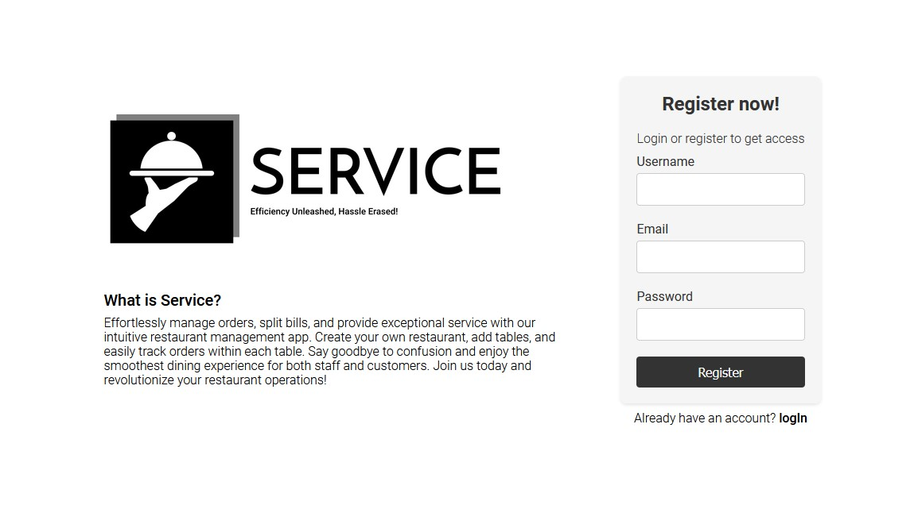
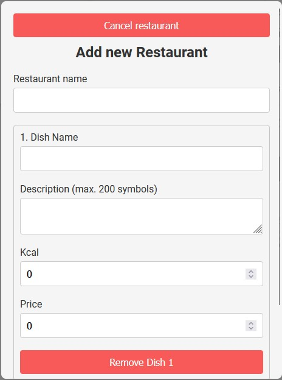
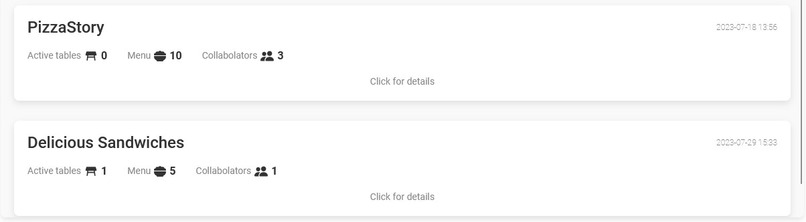
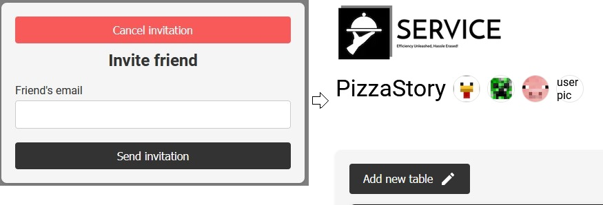
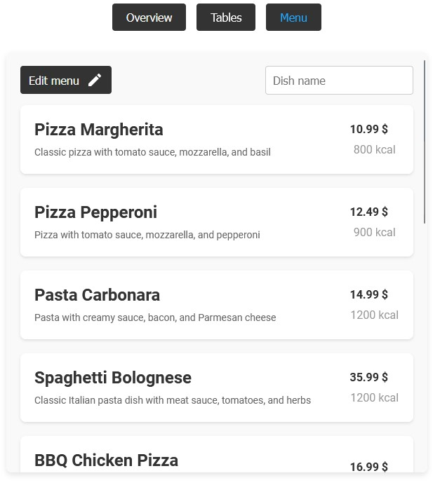
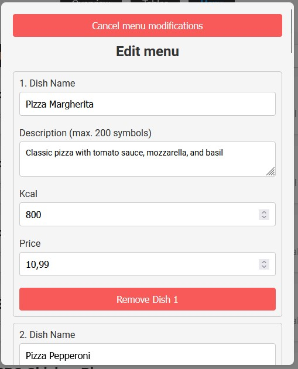
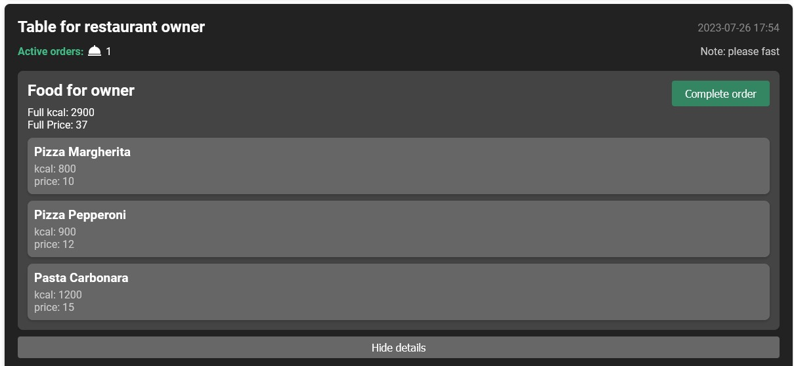

# Welcome to Service

"The application is currently under development, and at this stage, I encourage you to review the code. The live version will be available for preview shortly."

## Programmed functionality:

## What is Service?

Application that allow waitstaff to add restaurants, menus with detailed dishes, manage tables, effortlessly split bills, solving billing and order management challenges. All data securely stored in a database.

## Register/login to get acces to app

## Add new restaurant

## Menage your restaurants

## Invite friend to your restaurant

Information about invitation will be visible in users profile

## Check menu in restaurant dashboard

## Edit menu whenever you want

## Menage restaurant tables

Enjoy Service!

