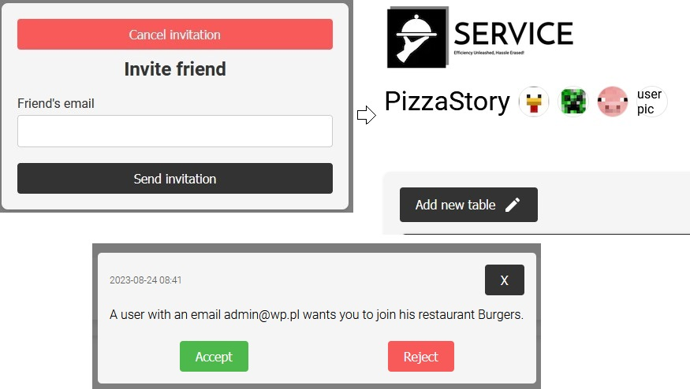
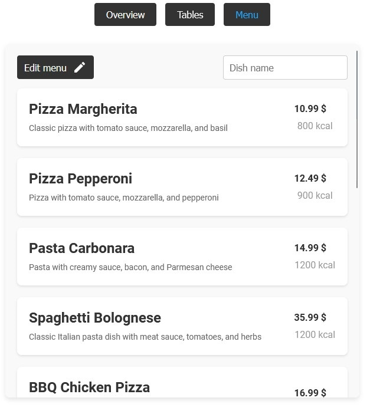
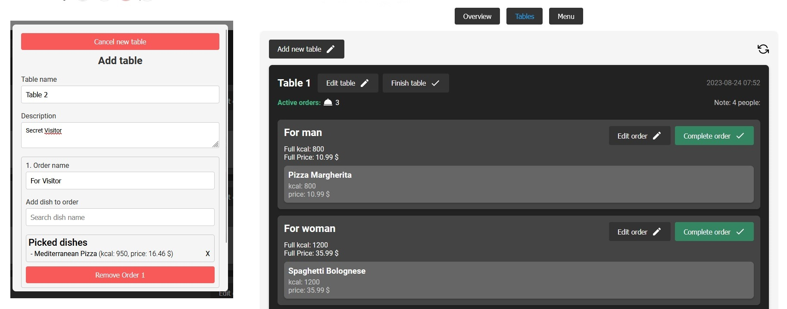
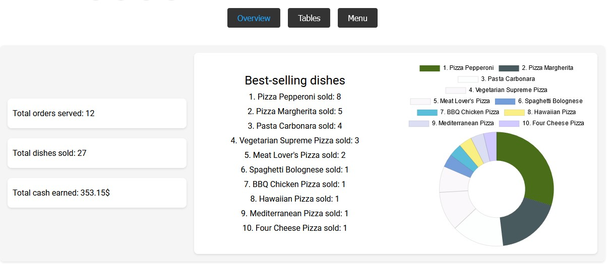

  <h3 align="center">LangChain-LearningPlatform - Get knowledge about modern AI technology!</h3>
  

    
    
    
     
    
  

**App is uploaded to free server. Server needs some time to start (about 30s or more). Loading screen is normal behavior.**

## 📋 <a name="table">Table of Contents</a>

1. 📎 [Introduction](#introduction)
2. ⚙️ [Tech Stack](#tech-stack)
3. 💻 [First Look](#first-look)
4. 😎 [About Me](#about-me)

## <a name="introduction">📎 Introduction</a>

Application that allow waitstaff to add restaurants, menus with detailed dishes,
manage tables, effortlessly split bills, solving billing and order management
challenges. All data securely stored in a database.

## <a name="tech-stack">⚙️ Tech Stack</a>

- NextJs
- NodeJs
- Express
- TypeScript
- MongoDB
- css-modules
- Email-service

## <a name="first-look">💻 First Look</a>

✨ Welcome to Service!

## Register/login to get access to app

Test credentials:
email: test@wp.pl
password: test

## Add new restaurant

When adding a new restaurant, the waiter selects the restaurant's name,
currency, and establishes a menu that can be easily edited later on.

## Menage your restaurants

In the user's main dashboard, all the restaurants created by them are available.
Each restaurant block provides summarized information about the respective
restaurant.

## Invite friend to your restaurant

Information about invitation will be visible in users profile

## Check menu in restaurant dashboard

## Edit menu whenever you want

## Menage restaurant tables

In the application, a waiter has the ability to create a new table, manage it
(add new orders, complete orders, edit individual orders), and can also edit the
entire table to make changes to orders or descriptions.

## Check Restaurant Statistics

The application provides insights into the statistics of a particular
restaurant: you can see which dishes are selling the best, how much revenue the
restaurant has generated, and how many orders it has fulfilled.

## <a name="about-me">😎 About Me</a>

Hello this app was created by me! Enjoy. If you have any question, feel free to
create new issue ticket. Otherwise you can contact me via my socials or email:

- 📱 <a href="https://www.linkedin.com/in/emil-szymczyk-209613209/">linkedin</a>
- 📧 email: emil-szymczyk2@wp.pl

Enjoy Service!
